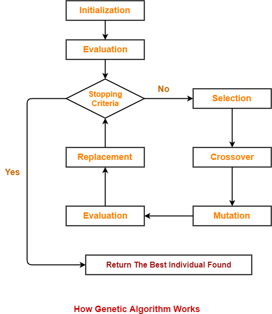

# Neural-Network-Optimization-using-Genetic-Algorithm-from-scratch
Its small project, where i designed the Genetic-Algorithm from scratch to optimize the artificial neural network.

How the genetic algorithms work can be seen in the below flow diagrame.

